# FitTrack - Application de Suivi d'Entraînement

Application web complète de gestion et suivi d'entraînement sportif développée avec la stack MERN (MongoDB, Express, React, Node.js).

## Aperçu

FitTrack est une application web moderne permettant aux utilisateurs de :
- Créer et gérer leurs exercices personnalisés
- Planifier des programmes d'entraînement
- Suivre leurs séances d'entraînement
- Monitorer leur progression physique (poids, mensurations, IMC)
- Visualiser leurs statistiques et évolution

## Fonctionnalités

### Authentification
-  Inscription et connexion sécurisée
-  Authentification JWT
-  Gestion de profil utilisateur
-  Hachage des mots de passe avec bcrypt

### Gestion des Exercices
-  Créer des exercices personnalisés
-  Catégoriser par groupe musculaire
-  Filtrer par difficulté et catégorie
-  Base de données d'exercices complète

###  Programmes d'Entraînement
-  Créer des programmes personnalisés
-  Planifier les exercices, séries et répétitions
-  Dupliquer et modifier des programmes
-  Programmes Push/Pull/Legs et Full Body

###  Suivi des Séances
-  Enregistrer les séances d'entraînement
-  Suivre les performances (poids, reps)
-  Ajouter des notes et commentaires
-  Historique complet des séances

###  Progression
-  Suivi du poids et des mensurations
-  Calcul automatique de l'IMC
-  Graphiques d'évolution
-  Statistiques détaillées

### x Interface Utilisateur
-  Design moderne et responsive
-  Mode sombre/clair
-  Animations fluides
-  Interface intuitive

##  Technologies utilisées

### Backend
- **Node.js** - Environnement d'exécution JavaScript
- **Express.js** - Framework web
- **MongoDB** - Base de données NoSQL
- **Mongoose** - ODM pour MongoDB
- **JWT** - Authentification par tokens
- **bcrypt** - Hachage de mots de passe
- **express-validator** - Validation des données
- **Jest** - Tests unitaires

### Frontend
- **React** - Bibliothèque UI
- **React Router** - Navigation
- **Context API** - Gestion d'état
- **Axios** - Client HTTP
- **Recharts** - Graphiques et visualisations
- **CSS3** - Styles et animations

##  Prérequis

- Node.js >= 18.0.0
- npm >= 9.0.0
- MongoDB >= 6.0
- Git

##  Installation

### 1. Cloner le repository

## bash
git clone https://github.com/AnasGabbadi/fittrack.git
cd fittrack

### 2. Installer les dépendances Backend
bash
cd server
npm install

### 3. Installer les dépendances Frontend
bash
cd ../client
npm install

### 4. Configuration
Créer les fichiers .env (voir Configuration)

### 5. Initialiser la base de données
bash
cd server
npm run seed

###  Configuration

## Backend (.env)
Créer un fichier .env dans le dossier server/ :

text
NODE_ENV=development
PORT=5000
MONGO_URI=mongodb://localhost:27017/fittrack
JWT_SECRET=votre_secret_jwt_super_securise
JWT_EXPIRE=7d

## Frontend (.env)
Créer un fichier .env dans le dossier client/ :

text
VITE_API_URL=http://localhost:5000/api
Variables d'environnement
Variable	Description	Valeur par défaut
NODE_ENV	Environnement d'exécution	development
PORT	Port du serveur backend	5000
MONGO_URI	URI de connexion MongoDB	-
JWT_SECRET	Clé secrète pour JWT	-
JWT_EXPIRE	Durée de validité du token	7d

###  Utilisation

## Démarrage du Backend
bash
cd server
npm run dev
Le serveur démarre sur http://localhost:5000

## Démarrage du Frontend
bash
cd client
npm run dev
L'application démarre sur http://localhost:5173

## Comptes de démonstration
Après avoir exécuté npm run seed, vous pouvez vous connecter avec :

Email	Mot de passe	Profil
anas@fitness.com	password123	Utilisateur avancé
sarah@fitness.com	password123	Débutant
omar@fitness.com	password123	Expert

###  Tests

## Tests Backend
bash
cd server
npm test                    # Lancer tous les tests
npm run test:coverage       # Tests avec couverture

## Couverture actuelle
text
All files         |   90%+  |   90%+  |   100   |   90%+  |
Controllers       |   88%   |   92%   |   100   |   87%   |
Models            |   95%   |   75%   |   100   |   100   |
Routes            |   100   |   100   |   100   |   100   |
Middleware        |   100   |   95%   |   100   |   100   |

###  API Documentation Swagger
Documentation complète disponible dans : http://localhost:5000/api-docs

##  Aperçu de l'Application

###  Version Desktop

####  Authentification & Accueil
<table>
  <tr>
    <td width="50%" align="center">
      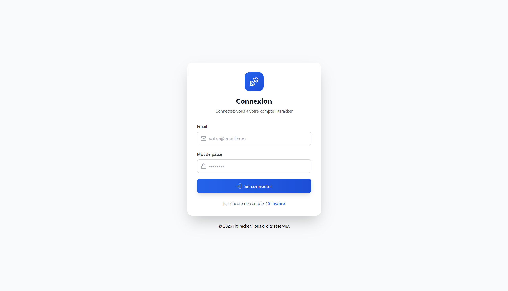
       <b>Connexion</b>
       Authentification sécurisée avec JWT
    </td>
    <td width="50%" align="center">
      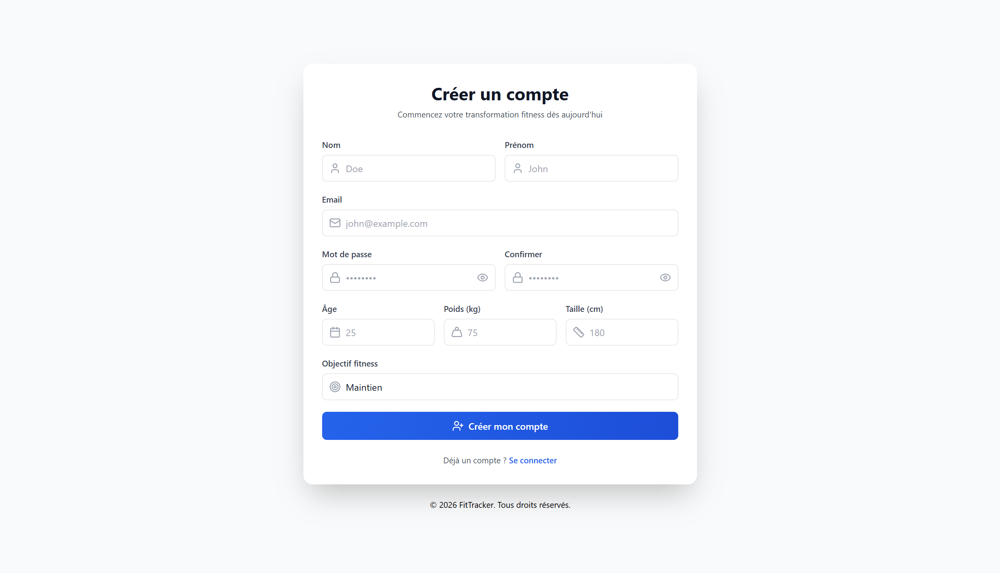
       <b>Inscription</b>
       Création de compte avec validation
    </td>
  </tr>
</table>

####  Tableau de Bord & Navigation
<table>
  <tr>
    <td width="50%" align="center">
      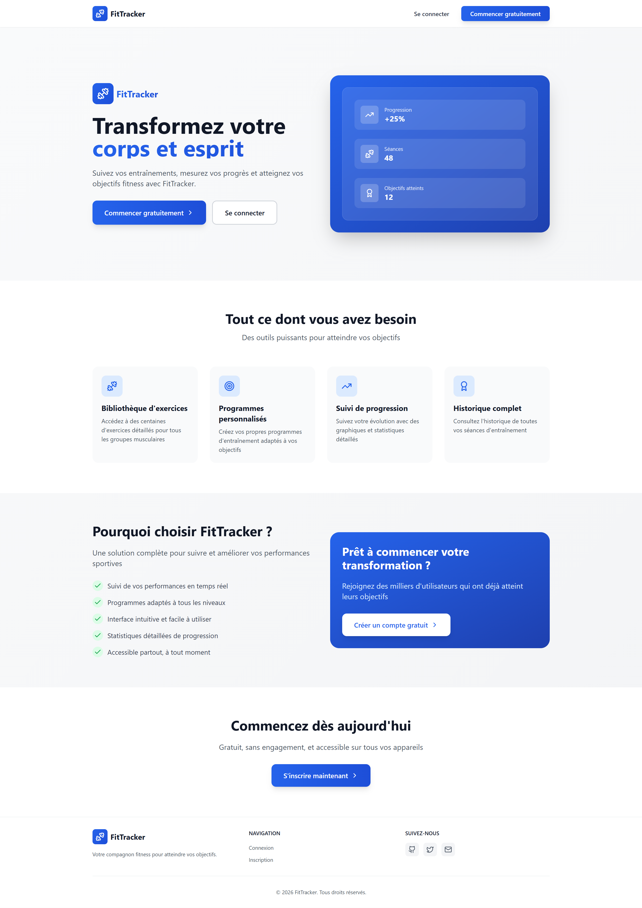
       <b>Accueil</b>
       Vue d'ensemble de votre activité
    </td>
    <td width="50%" align="center">
      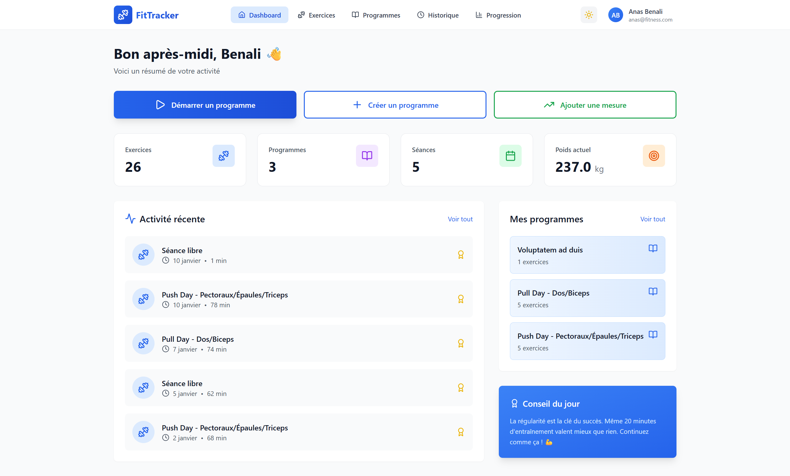
       <b>Tableau de bord</b>
       Statistiques et métriques en temps réel
    </td>
  </tr>
</table>

####  Gestion des Entraînements
<table>
  <tr>
    <td width="50%" align="center">
      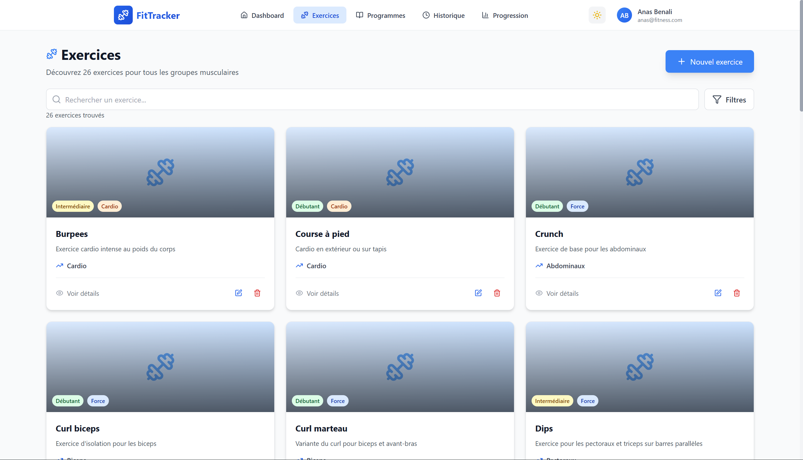
       <b>Exercices</b>
       Bibliothèque complète d'exercices
    </td>
    <td width="50%" align="center">
      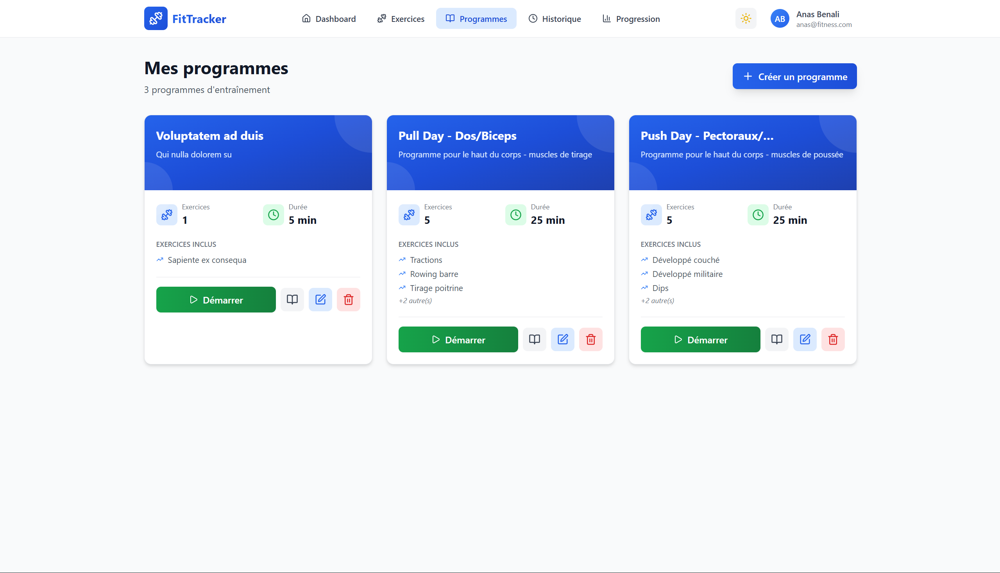
       <b>Programmes</b>
       Plans d'entraînement personnalisés
    </td>
  </tr>
</table>

####  Suivi & Analyse
<table>
  <tr>
    <td width="50%" align="center">
      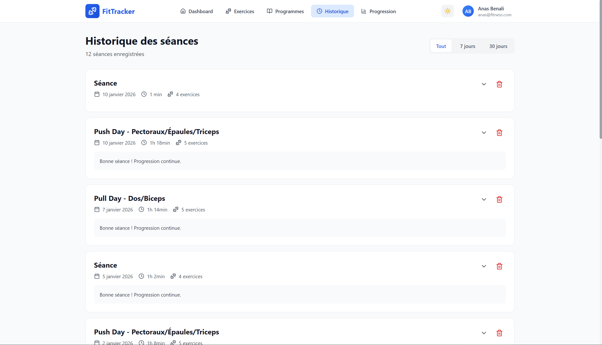
       <b>Historique</b>
       Journal détaillé des séances
    </td>
    <td width="50%" align="center">
      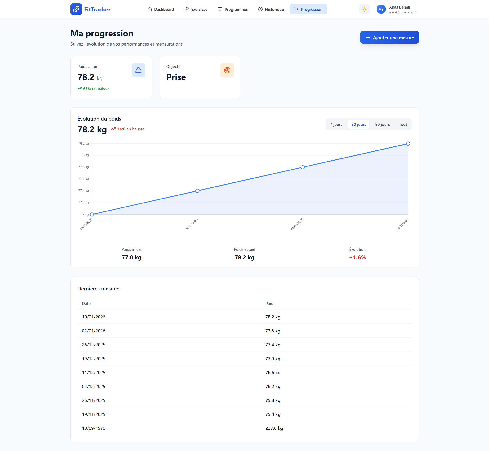
       <b>Progression</b>
       Évolution avec graphiques interactifs
    </td>
  </tr>
</table>

####  Profil Utilisateur

  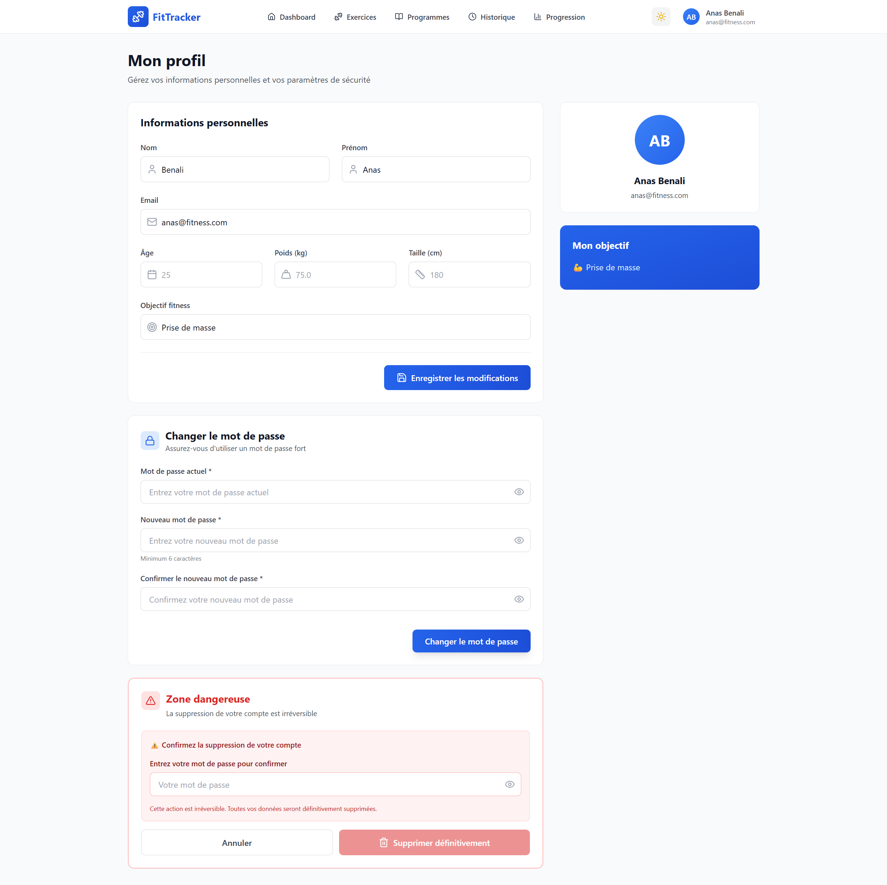
   <b>Profil</b>
   Gérer vos informations personnelles

---

###  Version Mobile

  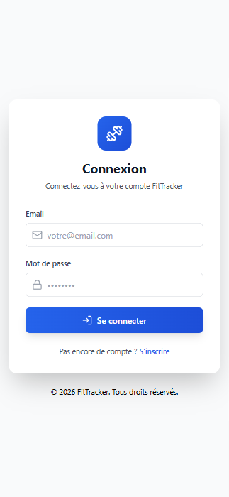
  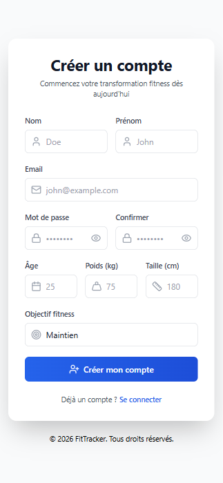
  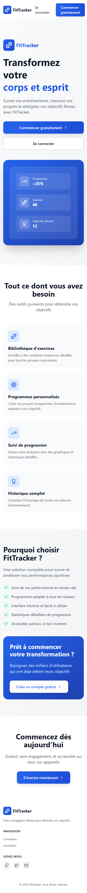
  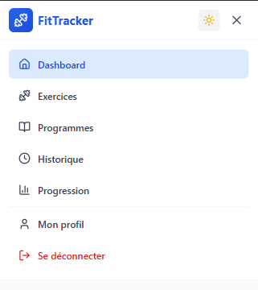

  <b>Authentification • Inscription • Accueil • Menu</b>

  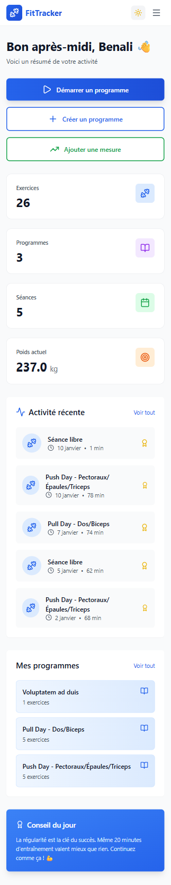
  
  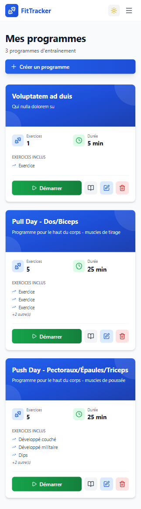
  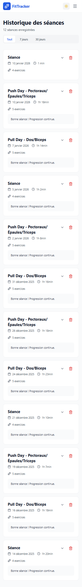

  <b>Dashboard • Exercices • Programmes • Historique</b>

  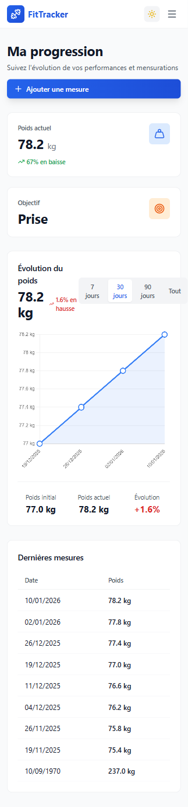
  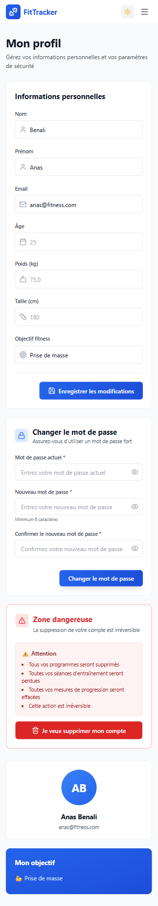

  <b>Progression • Profil</b>

  Interface entièrement responsive • Mode sombre inclus

